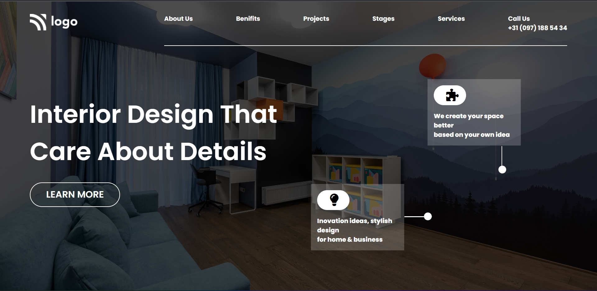

# Project-8

This project is a Interior Design Webpage which is created by using HTML and CSS. It's responsive.

## Authors

 >Manish Kumar

## What I learnt while creating this project

- Learnt about Media Queries
- Learnt CSS Grid and Positioning
- Learnt about linear-gradient and background effect

## Honest Time to Finish Project

2.5 hours

# Netlify Link

[Project - 10](https://project-10-mk.netlify.app/)

# Thumbnail

